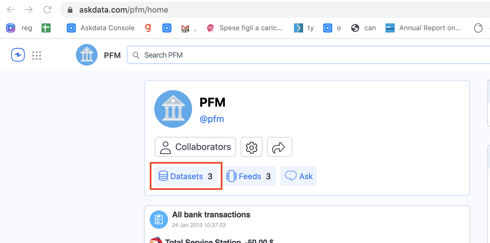

In order to import CSV or TSV from a Github repository it's possible to use the CSV dataset.

Steps:

1. Go on th **Agent main page**
2. Click on the **Datasets** button

3. Click on **Add Dataset** button

4. Select the **CSV Dataset**

5. Fine the remote link of the CSV

First, we need to find the data file in GitHub. That's simply a matter of navigating through the directory tree in a repository until we're able to open up a preview of the contents. Then, right click (or control-click) on the Raw button on the top right, and save the link address.

In the cases where a data file is too large to preview, then there won't be a Raw button - instead, right click on the Download button and save the link address.

6. Paste the link the in the remote field

7. Select other options and save your dataset!