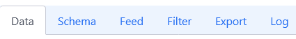

# Configure your first dataset

When you [connect a new dataset](https://docs.askdata.com/docs/how-to-connect-a-dataset), you may be interest in enhancing your data. For example, you may want to create an artifical column aggregated from other columns or just change a column type. Askdata provides several options to modify and update your data.*All the modifications must be done from the user that has the right to access the global data*.  
From the agent homepage, the first step is to navigate to the **dataset** panel and then to choose the one you would like to edit. 

  

When the page is loaded you will have an overview of the first 5 rows of your datasets. You can dynamically Remove/add columns just for visualization purposes. You will also have the following menù just above your data:

  

- **Data**: An overview of your data
- **Schema**: Basic information about the columns of your data with the possibility to change/create some features
- **Feed**: Data Cards linked with this data
- **Filter**: Specify specific filters allowing/restricting acces to data
- **Export**: Integration with the Python Askdata SDK
- **Relationships**: Add a relationship with another existing dataset
- **Log**: Log of the operations that have been performed

Among all this fields, two need to be deepened: **Schema** and **Filter**.

## Schema

As mentioned earlier, this field provides an overview of the columns of your data. If want to edit a specific column just click on it and you will be prompted with a menù with the following editable options:

Main
- **Code***: Code to be used when referring to this column
- **Name**: Name of the column to be displayed
- **Parameter Type**: Type of the parameter: Dimension or Measure

Manage
- **Enabled**: Enable the column for queries
- **Import Values**: Choose if importing values(Yes) or not(NO)

Metadata
- **Description**: Description of the column
- **Sample Queries**: Example of queries to be associated with the column
- **Icon**: Change the icon of the column. Either pick one or upload yours.

NLP
- **Mandatory**: Set the column as mandatory.
- **Synonyms**: Synonyms can be manually associated to the column. This means that when I query using the synonyms, the selected column will be displayed.

Output
- **Aggregation**: Set an aggregation function among AVG, MIN, MAX and SUM
- **Indexed With**: Specify Technical key for the current column (onyl dimension) to optimize the query
- **Searchable**: Make elemnts in the results clickable to narrow down the dataset

Formatting
- **Number Formatting**: Set a format for the numbers. Various options available
- **Number Locale**: Set the region you are number refers to: us, en, it or fr.
- **Is Date**: Yes if this column is a date
- **Data Format**: Set a custom format for the dates
- **Date Formatting**: Set a standard format for the dates: dd-MM-yy or dd/MM/yy
- **Value Formatting**: Custom Javascript expression to format the values in the column. **Must** return a string

Dynamic
- **Synonym Generation Logic**: You can use a custom logic to generate synonyms with a specific behaviour
- **Custom**: boolean: Yes if you are creating a new column, No otherwise
- **Custom Expression**: You can define a custom logic to define a new column
- **Ignore Aggregation for Measures**: For custom expressions ignores the default aggregation of the measure
- **Custom Filter**: Inject a custom filter when a specific is requested
- **Dynamic Entities**: You can define a custom logic to automatically create entities related to that dimension
- **Defaul Injections**: Set another column to be shown with (i.e. when I query sales also show the year, without specifying the word year). Applied when no other dimensions and measures are requested  
- **Injections**: Set another column to be shown with (i.e. when I query sales also show the year, without specifying the word year). Always applied  

Geo
- **Is Geo Parameter**: Yes if this column is a Geo Parameter
- **Latitude**: Name of the field where to find the value of the latitude
- **Longitude**: Name of the field where to find the value of the longitude
- **External Resource**: Path for an external resource where to find the geo attributes
- **Key from external resource**: The name of the field in the external resource that contains the join field
- **Value Formatting**: Instructions on how to format the values

## Filters

Filters are powerful tools that can be used to restrict access to some data. For example if you are a manager in a company and would like one of your employees to access just the data that is related to himself, you could achieve that by defining a simple filter as in the picture:

  

For example in the above use case we are specifying that if the user login email is *employee@yourcompany.com* then just show him the records where *name=John* and *surname=Doe*. This obviously is a rather simple example of the definition of a filter, more complex ones can be build in order to guarantee the proper flexibility to your dataset. If you would like to have a deeper overview of filters you can watch [this resource](https://docs.askdata.com/docs/dataset-filters-configuration).

Once all the edits have been completed, just hit save and the dataset will be updated.
