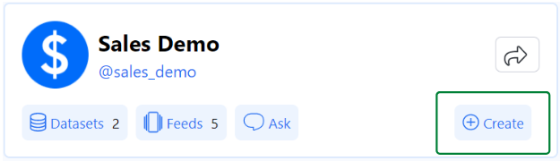
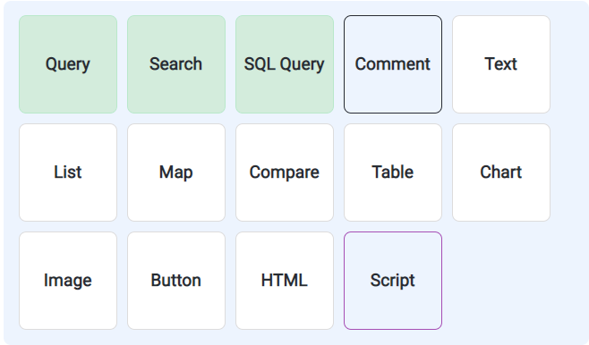
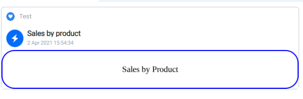
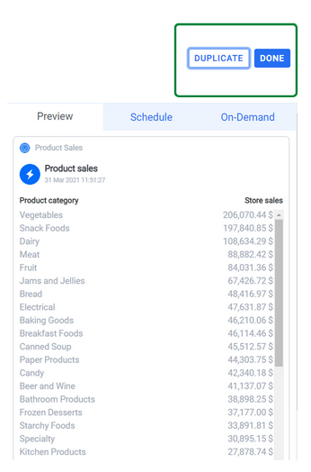

A Data Card is the simplest piece of content that can be exchanged on Askdata and it must be necessarily associated with a feed. <br/>
In order to create a Card, we can proceed in two ways:

## Create it from Agent's Home 

If you have already created a feed, you can generate a new card by clicking **Create** and then **Data Card**:

<p align="center" >
  
</p>

Then you will be asked to enter the name and to select the feed to associate the card with (you can also create a new feed from this page). 


<p align="center">
  
</p>

When you are done just click **Add** and you are good to go!

## Create it from a feed

If you have already [created a feed](https://docs.askdata.com/docs/be-productive-with-feeds.html), you can simply add a new card by clicking **New Data Card** and customize it with your name.

<p align="center">
  
</p>

When you are done just click **Add** and you are good to go!

# Customize your data card

Once you have created a Data card by using one of the available methods, we offer the possibility to highly customize it according to your style and to your requirements. With Askdata you can create different types of content within a Data Card, matching your needs with extreme neatness and enhancing your data experience. <br/>
</br>
When you enter a card that has just been created, you will be presented two sections by default:
* Data Card header
* Natural Language query
<p align="center">
  
</p>


If you click on a specific section, a tab on the right will be shown and you will be able to set all the desired properties. Now we are going to dive deeper in the two sections mentioned above.

## Data card header

The data card header allows you to change some of the default settings of the card. You are able to customize it:

* **Data Card Title**: Title of your data card that will be shown in the feed
* **Data Card Slug**: Slug used by our system, mustn't contain any space
* **Icon**: We offer a wide variety of icons available but you can also upload one from your device

When you are done customizing the settings click save and the system will update. This applies for all the components, **you must click save to show the updated resources**.

<p align="center">
  
</p>

## Natural Language query 

This is the component where the real power of Askdata shows up. If you click on the **Edit** button you will be prompted to enter the query in natural language. After hitting **Run** your results will be quickly shown together with the **recognized entities** and some suggestions on some **other possible interpretations** of your query.

<p align="center">
  
</p>

To save your NL query, just hit **Done** in the upper right corner or cancel if you want to discard it. <br/>

If you select a NL query, you can personalize it applying the properties you want to. Specifically, you are allowed to customize:

- **Query Name**: Name of the query displayed as header
- **Variable name**: Name of the variable to save the results to. You can later access this variable from other components.
- **Connection**: Some datasets support a specific connection (not the centralized one) for each user that perform a query
- **Perform NL2SQL before each execution**: Set this to True if you want **NL2SQL** (Natural Language 2 SQL) to be called at each execution.
- **Buckets**: Buckets are the way you can configure as output more than one Data Card, choosing the dimension over the Data Card will be split


## Other components
Now we are going to present all the different components that can be added to a data card in order to customize it:

<p align="center">
  
</p>


# Query
Select an (external) dataset, query it and apply filter on it. When you attach this component you will be prompted to select a dataset to query with the associated columns. After clicking **Done** it will be shown in the webpage. Moving to the left hand side panel, you can adjust the following properties:

- **Query Name**: Name of the query displayed as header
- **Variable name**: Name of the variable to save the results to. You can lates access this variable from other components.
- **Connection**: Some datasets support a specific connection (not the centralized one) for each user that perform a query
- **Buckets**: Buckets are the way you can configure as output more than one Data Card, choosing the dimension over the Data Card will be split


# Search
Add a new Natural Language Query. This component is similar to the [**Natural language Query**](#natural-language-query), please refer to the dedicated section.

# SQL Query
With this component you can autonomously add a new SQL query to retrieve thew results from your dataset. If enter the **Edit** mode, you can select the dataset and modify the editor with the query you would like to execute. Talking about the setings panel, these are the options:

<p align="center">
  
</p>

- **Query Name**: Name of the query displayed as header
- **Variable name**: Name of the variable to save the results to. You can lates access this variable from other components.
- **Connection**: Some datasets support a specific connection (not the centralized one) for each user that perform a query
- **Native Type Query**: Allows to send a native query to the selected dataset.
- **Buckets**: Buckets are the way you can configure as output more than one Data Card, choosing the dimension over the Data Card will be split


After customizing it, press **Save** to proceed.
# Comment
This is thought to be a support for who is working on the data card. It is a component that stores text that won't be available in the final data card on the feed. In the settings panel on the left, you can enter the comment name and the text. 

Once you have done that, clisa **Save**, to proceed.

# Text
Unlike Comment this is a text section that will be available in the resulting data card. All the others considerations remain the same. 

# List
This component allows you to show your results in a more compact way, printing them as a List. You can adjust the following properties:

<p align="center">
  
</p>

- **Component Name**: Set the name of the component
- **Query**: The name of the query you are referring to. This is what you defined under the variable name in [Query](#query)
- **Title**: Set the title
- **Description**: Set the description
- **Number of displayed rows**: Adjust the number of rows displayed
- **Call To Action Enabled**: Call to action enabled next to every item
- **Action label**: The label of the action (if enabled)
- **Action URL**: The URL of the action (if enabled)

# Map
Special type of chart that shows your results on map. The result of the NL query must be suitable to be shown on a Map.

# Compare
This component allows you to compare the results of two different queries. Yo can access the results by specifying the varibale name you defined in the NL query. In the settings panel you have the following options:
<p align="center">
  
</p>

- **Name***: Set the name of the comparison component
- **Query***: Select the first query
- **Measure***: Set the measure in the query
- **Label**: Pick the label..
- **Custom Label**: Or define a custom label
- **Description**: Set {{P}} to show the difference in percentage or {{AV}} to use the absolute value

The above parameters can be specified for both the queries.

- **Formatting***: Set **High is Better** or **Low is Better** to set the criterion for the comparison

# Table
This component allows you to show your results in a more compact way, printing them as a Table. You can adjust the following properties:

<p align="center">
  
</p>

- **Name**: Set the name of the component
- **Query**: The name of the query you are referring to. This is what you defined under the variable name in [Query](#query)
- **Columns**: Select the columns to show in the Table.
- **Number of displayed rows**: Adjust the number of rows displayed

Hit save and the component will be updated according to your preferences.

# Chart
This component allows you to show your results in a chart without writing a single line fo code. We have different types of charts available.

<p align="center">
  
</p>

- **Name**: Set the name of the component
- **Query**: The name of the query you are referring to. This is what you defined under the variable name in [Query](#query)
- **Type**: charts **currently** available: Horizontal Bar, Line, Pie, Radar, Donut, Vertical Bar, Stacked Area, Stacked Horizontal, Stacked Vertical
- **parameters**: The varibales to be considered for the chart

Hit save and the component will be updated according to your preferences.

# Image 
Paste an Image in your data card. In the settings panel you can set a title for the Image and Upload one/Choose from existing ones. Hit **Save** and the image will be displayed in the preview.

# Button 
Link an external resource such as a PDF, DOC, web page.... You just need to configure the name of the component, the label and the URL. 

# HTML
This component allows the user to implement HTML code to enhance the Data Card. The code could be used for graphical reason (as shown in the picture below) but also for more practical ones. In fact, the results of the query can be accessed within the HTML editor(the variable name must be specified in the settings tab), which is available by clicking the **Edit button**. Here is an example:
<p align="center">
  
  
</p>

**More info:** [HTML Component Configuration](/docs/data_card_html_component)

# Script 
This component allows the definition and execution of javascript code,  **Python** to be supported soon. The code has access to all of the query result sets, identified by the variable name assigned to them on the query component settings. Also the results of other script components can be used if they preced this one. The script can be any valid javascript code. The last expression is the script result. It can be any object or a function. For example:
```
// Example 1:
   { 'name' : q1Result[0].customer, 'revenue' :q1Result[0].revenue }
//   returns an object with 'name' and 'revenue' fields obtained from the first element of the array q1Result.
```
<p align="center">
  
</p>

In the settings panel, you can set the **component name** and the **Variable name*** that is the Name of the variable to save the results to. You can later access this variable from other components.
## Moving/deleting the component

For every component you have to possibility to **delete** it using the bin icon just on the right hand side of the component and to **move it up/down** on the card using the arrows on the left hand side.

## Saving the data card

When finished customizing the card, you can have a preview of it hitting the **Preview** button.
<p align="center">
  
</p>

At this point you can either **Duplicate** it (i.e. copy it in another feed) or click **Done** to finish the process.


Stay Tuned on this page since we are constantly developing new components to enhance your experience with data!
