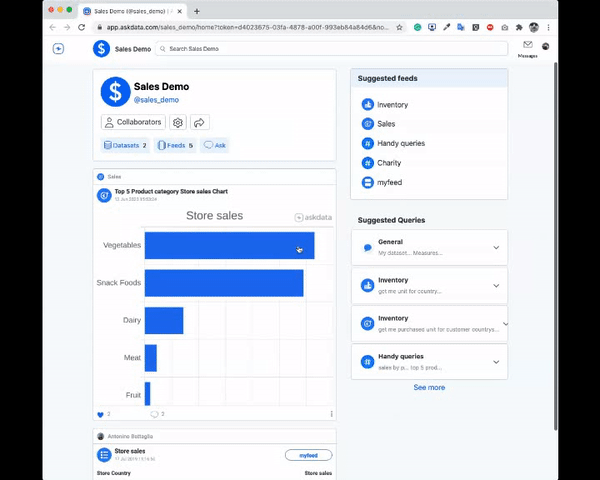
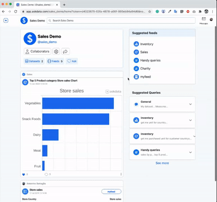
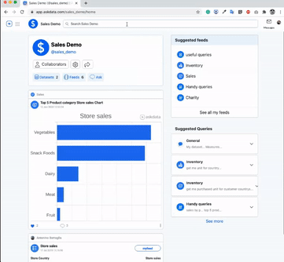
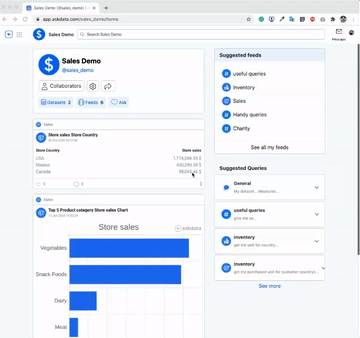

Search
------

Users can **query the data** at any time through the search bar. The Agent searches across all data to answer the questions. The cards provided by the Agent can be saved and shared as stated before.  

In order to enable users to quickly find and select the information they need, when the user is typing the query system provides useful suggestions like most **frequent queries** similar to the ones the user is writing (drop-down menu) and the **autocomplete** of the query with the entities the system is aware.

  

### Comment

Users can add one or more comments. The comments are visible to all users who view the card

  

### Share a data card

 
The system provides different ways to share a card.

* **Republish insight**: publish the card in a feed (public or private). In this way all users viewing the (public) feed will also see the new card.
* **Save Query**: save the query that produced the card as an answer.
* **Share To a Contact**: share the card with a specific user through a private message using the internal messaging system.

### Download

Card data can be downloaded in different format:

* **Export Data Card**: download an image (.png) of the card
* **Download Query**: create a textual file (.csv) with the data of the card
* **Connect to live data**: code snippets are provided to embed card in Google Sheets and Python apps.  

### Queries

Queries are samples of questions users can ask the Agent. Queries can be saved by users to be re-proposed to the Agent at any time.  

#### Save Query

In the sample below, the user asks a question throughout the search bar, the system provides the card, then the user clicks on the card going in the details view. From the details view, in the Current Query section, the user clicks on the symbol highlighted in the image

  

#### Execute Saved Queries

Users execute the saved queries selecting them from the “Suggested Queries”. Saved queries are organized in bookmarks with the same name of the feeds. 

Using the Mobile App the bookmarks are accessible selecting the “feed” section from the Home then the specific bookmark and then the “Queries” tab. 

‍

    

    
